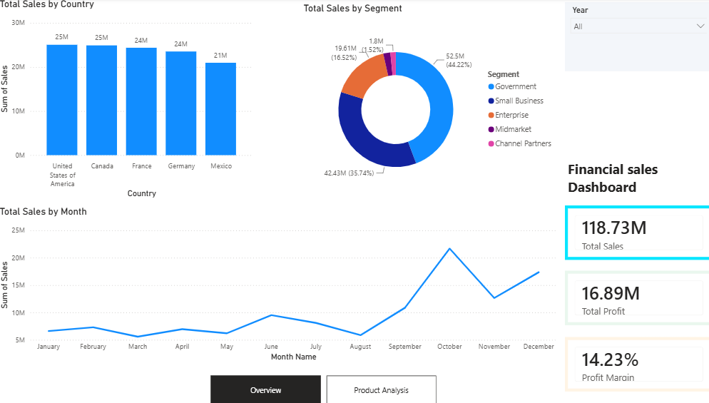

# Financial Sales Power BI Dashboard

## Project Overview

This project presents an interactive financial sales dashboard developed using Microsoft Power BI. The dashboard transforms financial sales data into clear and actionable business insights, allowing users to explore overall sales performance, profitability, geographical performance, customer segments, monthly trends, and product-level results.

The report consists of two pages:

1. **Overview** – provides a high-level summary of financial performance.
2. **Product Analysis** – provides a detailed breakdown of sales, profit, and units sold by product.

## Key Performance Indicators

The dashboard highlights the following overall KPIs:

* **Total Sales:** 118.73M
* **Total Profit:** 16.89M
* **Profit Margin:** 14.23%

## Dashboard Features

### Overview Page

The Overview page includes:

* Total Sales by Country
* Total Sales by Segment
* Total Sales by Month
* Year slicer for interactive filtering
* Total Sales KPI
* Total Profit KPI
* Profit Margin KPI
* Navigation to the Product Analysis page

### Product Analysis Page

The Product Analysis page includes:

* Sales by Product
* Profit by Product
* Units Sold by Product
* Product selection/filtering
* Total Sales KPI
* Total Profit KPI
* Profit Margin KPI
* Navigation back to the Overview page

## Key Insights

* Overall sales reached **118.73M**.
* Total profit reached **16.89M**.
* The overall profit margin was approximately **14.23%**.
* Paseo generated the highest sales among the products displayed.
* The dashboard allows financial performance to be compared across countries, customer segments, months, and products.
* Monthly sales trends make it easier to identify periods of stronger and weaker sales performance.

## Tools and Skills Demonstrated

* Microsoft Power BI Desktop
* Data visualization
* Dashboard design
* KPI development
* Interactive slicers and filtering
* Business intelligence reporting
* Sales and profitability analysis
* Page navigation
* Data-driven storytelling

## Dashboard Preview

## Project Files

* `Financial Sales Dashboard.pbix` – Interactive Power BI Desktop report
* `Financial Sales Dashboard.pdf` – Exported static version of the completed dashboard

## Dashboard Usage

Download and open the `.pbix` file using Microsoft Power BI Desktop to access the interactive report. The PDF version can be viewed without Power BI and provides a static preview of the completed dashboard.

## Author

**Martin ude**
Data Analyst | Data Science & Machine Learning Portfolio
